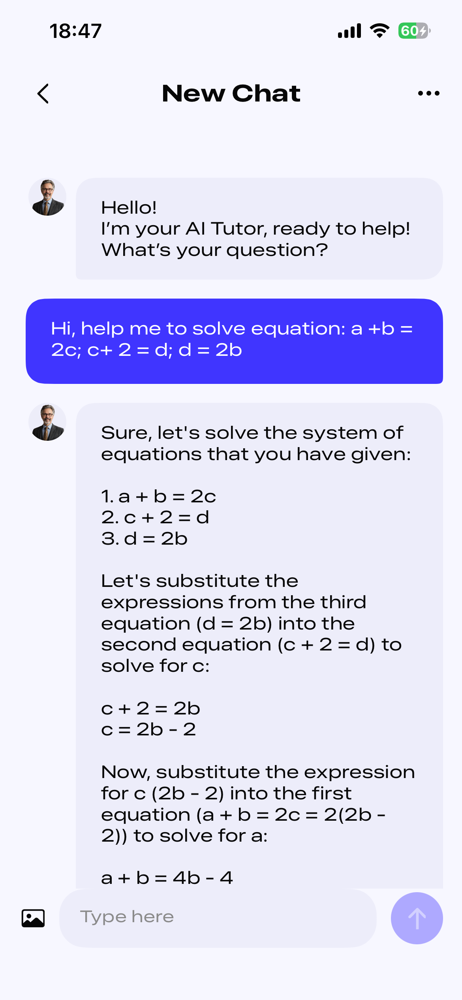
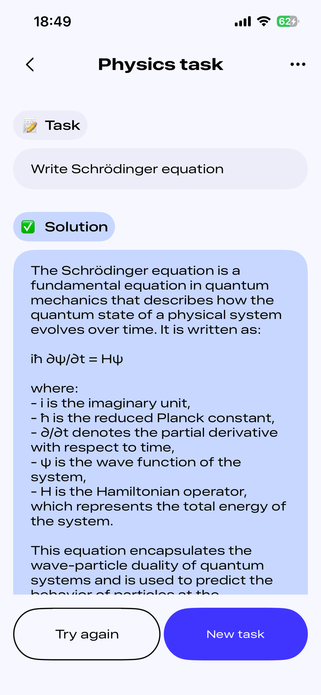
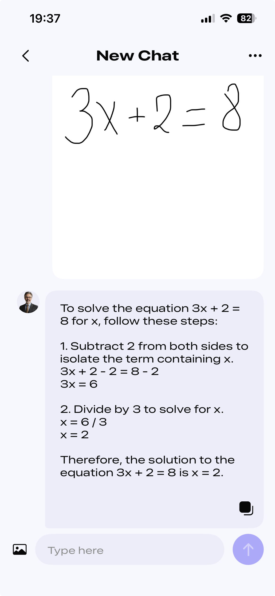

# AIHomeWork

AIHomeWork is an educational iOS app that integrates an AI-based chat system to support students with their homework and academic subjects.  
The app enables quick and interactive help, making learning more efficient and accessible.

## Features
- AI chat for homework assistance  
- Support for multiple subjects  
- Upload or capture images as part of chat requests  
- Easy-to-use interface  
- iOS app built with UIKit  

## Requirements
- iOS 16.0+  
- Xcode 15+  
- Swift 5.9+  

## Technologies
- Swift / UIKit  
- CoreData  
- MVVM + Coordinator + Assembler architecture  
- AI API integration (e.g. OpenAI API)  

## Architecture
- **MVVM:** separates UI from business logic for clear data flow  
- **Coordinator:** manages navigation and app flows  
- **Assembler:** dependency injection and module setup for flexibility and testability  

## Image-to-Chat
AIHomeWork allows users to **capture photos or upload images** from the library and use them directly as part of an AI chat request.  
This makes it easy to get help on homework problems by simply photographing them.

### Permissions
- Camera (`NSCameraUsageDescription`): *Allow camera access to capture homework photos.*  
- Photo Library (`NSPhotoLibraryUsageDescription`): *Allow photo access to upload images to the AI chat.*  

## Screenshots

### New Chat

### Task Example

### Image-based Task

## Installation
1. Clone the repository: git clone https://github.com/EgorPetkevich/AIHomeWork.git
   
